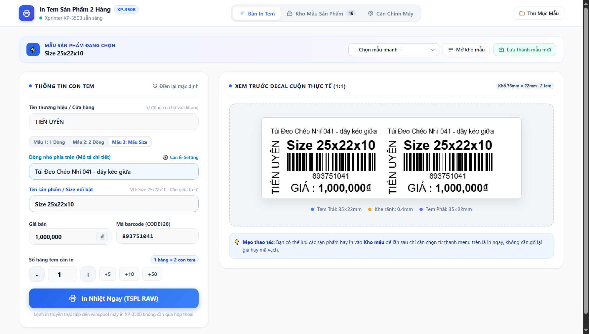
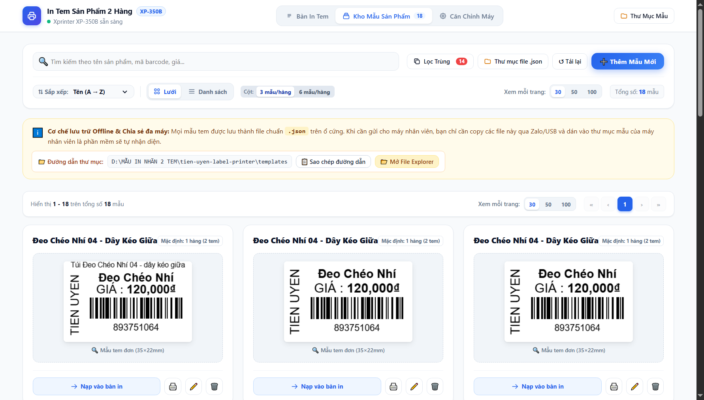

# 🖨️ Phần mềm In Tem Sản Phẩm 2 Hàng (Xprinter XP-350B)

Ứng dụng mã nguồn mở gọn nhẹ chuyên dụng để in **2 tem sản phẩm / mã vạch song song** trên một hàng giấy decal khổ cuộn **76 mm** (kích thước mỗi tem **35 × 22 mm**) dành cho các dòng máy in nhiệt trực tiếp **Xprinter XP-350B**.

Tự động khởi động hệ thống và mở giao diện web tại `http://127.0.0.1:9638/`.

---

## ⚡ TẢI NHANH BỘ CÀI ĐẶT

Bấm vào link bên dưới để tải trực tiếp file `.exe` về máy tính sử dụng ngay:

| Loại bộ cài | Link tải trực tiếp | Mô tả & Hướng dẫn |
| :--- | :--- | :--- |
| **Bản Cài Đặt Tự Động** *(Khuyên dùng)* | 📥 [**TẢI BẢN SETUP (Setup-InTem-XP350B.exe)**](https://github.com/stephenpham68/In-tem-san-pham-XP-350B/raw/main/Setup-InTem-XP350B.exe) | Tải về nhấp đúp: Tự động cài vào `C:\Program Files\In-tem-san-pham-XP-350B`, tạo **Icon ngoài Desktop**, tự mở web và hỗ trợ gỡ cài đặt sạch sẽ qua **Control Panel**. |
| **Bản Portable (Chạy ngay)** | 📥 [**TẢI BẢN PORTABLE (InTemXP350B.exe)**](https://github.com/stephenpham68/In-tem-san-pham-XP-350B/raw/main/InTemXP350B.exe) | Tải về mở là chạy ngay lập tức, không cần cài đặt. |

> 💡 **Sử dụng hàng ngày**: Sau khi cài đặt, bạn chỉ cần nhấp vào biểu tượng **"In Tem San Pham XP-350B"** ngoài Desktop là trình duyệt sẽ tự động mở giao diện in tại `http://127.0.0.1:9638/`.

---

## 📸 Giao diện trực quan (UI Dashboard Preview)

### 1. Bàn In Tem & Xem trước Decal thực tế (1:1)
> Giao diện trực quan cho phép nhập thông tin sản phẩm, chọn 3 mẫu tem chuẩn ngành, xem trước kích thước decal 2 tem 1:1 siêu nét và in nhiệt tức thì qua lệnh TSPL RAW.

### 2. Quản lý Kho Mẫu Tem Nhãn (Offline & Đa máy)
> Tìm kiếm tức thì, lọc trùng lặp sản phẩm, xem trước thẻ mẫu trực quan, nạp nhanh vào bàn in và chia sẻ file JSON giữa nhiều máy trạm nội bộ không cần Internet.

---

## ✨ Tính năng nổi bật

* **Quản lý Kho Mẫu Sản Phẩm (Template Manager)**:
  * Tab riêng biệt **Kho mẫu**: Tìm kiếm tức thì theo tên mẫu, sản phẩm, giá bán hoặc mã vạch barcode.
  * Thêm, sửa, xóa các mẫu tem sản phẩm nhanh chóng.
  * Bấm **"📥 Nạp mẫu này vào tab in"** hoặc **"🖨️ In ngay mẫu này"** chỉ với 1 click.
  * Bấm **"💾 Lưu vào kho mẫu"** trực tiếp ngay tại tab in sau khi nhập thông tin mới.
  * **Lưu file Offline nội bộ máy**: Mọi mẫu tem được lưu thành file chuẩn `.json` trong thư mục `templates/` của máy.
  * **Chia sẻ tức thì giữa nhiều máy tính nhân viên**: Chỉ cần bấm nút **"📁 Mở thư mục mẫu"** trên giao diện, copy folder hoặc các file `.json` đưa sang máy nhân viên dán vào là hệ thống tự động nạp mẫu ngay, không cần phụ thuộc Internet hay đồng bộ Cloud.
* **Tùy biến Thương hiệu / Tên cửa hàng**:
  * Tự do chỉnh sửa tên thương hiệu (mặc định mẫu là `TIẾN UYÊN`).
  * **Auto-fit & Anti-overflow**: Tên cửa hàng dù ngắn hay dài đều được thuật toán tự động co giãn kích thước chữ (auto-resize) vừa khít con tem, không bao giờ bị cắt hay tràn ra ngoài mép.
  * Nếu để trống trường thương hiệu, nội dung tem sẽ tự động mở rộng chiếm trọn chiều rộng của con tem.
* **Định dạng chuẩn ngành bán lẻ**:
  * In song song 2 tem trên 1 hàng (tốc độ in nhanh gấp đôi).
  * Hỗ trợ tên sản phẩm, giá bán, mã vạch Barcode chuẩn CODE128 sắc nét và số hiển thị bên dưới.
* **In nhiệt siêu tốc qua TSPL RAW**:
  * Gửi lệnh nhị phân TSPL trực tiếp tới driver `winspool.drv` của máy in, in tức thì mà không cần qua hộp thoại in mặc định của trình duyệt.
* **Tọa độ căn lề thực tế đã được tinh chỉnh chuẩn xác**:
  * Khổ cuộn: `76 mm` (gồm cả viền lề).
  * Kích thước mỗi tem: `35 × 22 mm`.
  * Khoảng cách rãnh giữa 2 tem: `0.4 mm`.
  * Khoảng cách bước nhảy hàng (gap): `3.0 mm`.
  * Dời ngang X: `-1.5 mm` | Dời dọc Y: `+1.5 mm`.
* **Lưu cấu hình riêng theo từng máy**:
  * Mỗi máy tính / máy in nếu có độ xê dịch cơ học khác nhau có thể tự căn chỉnh trong mục `⚙ Tùy chỉnh vị trí in (Offset) ▼` và bấm **"💾 Lưu cấu hình"** để lưu lại trên chính máy đó.
  * Nút **"↺ Mặc định"** giúp nhanh chóng khôi phục lại bộ tọa độ chuẩn ban đầu.

---

## 🛠️ Dành cho lập trình viên (Chạy từ mã nguồn)

1. Cài đặt Python 3.8+ và Node.js.
2. Cài đặt thư viện Python: `pip install Pillow pywin32`
3. Cài đặt frontend: `npm install`
4. Build giao diện: `npm run build`
5. Khởi động server: chạy file `start.bat` hoặc lệnh `python agent/server.py`.
